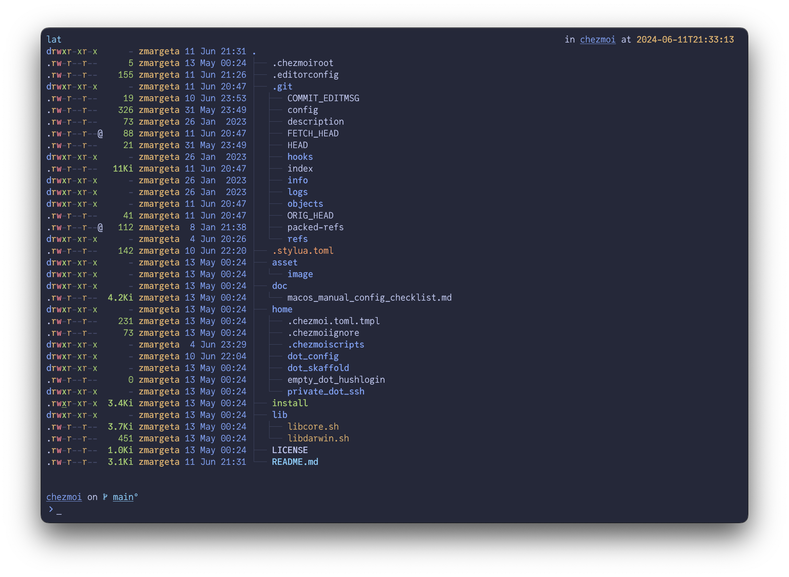

# zmargeta's .files



This repository contains my dotfiles managed by [chezmoi](https://github.com/twpayne/chezmoi).

## Quick Start

First, [download](https://downloads.1password.com/mac/1Password.zip) and install the [1Password](https://1password.com/product/mac) password manager.

> 1Password version 8 is required since it features an SSH agent, which stores the GitHub SSH key.

Next, enable 1Password's SSH agent (Developer > SSH Agent > Use SSH agent).

After configuring 1Password, download and execute the [installation script](./install).

```console
bash -c "$(curl -fsSL https://raw.githubusercontent.com/zmargeta/dotfiles/main/install)"
```

After running the install script, chezmoi is aliased to `dot` in Fish shell.

## Manual Configuration

Depending on the OS, go through one of the checklists (you can import it to **Obsidian** first):

- [macOS checklist](./doc/macos_manual_config_checklist.md)

Manual configuration checklists contain all the required steps to follow, in order.

They also include the **Quick Start** steps and are the **preferred way to setup a new machine**.

## Tools & Apps

What is included out of the box for **macOS**?

- Homebrew [dependencies](./home/.chezmoiscripts/darwin/run_onchange_before_03_install_packages.tmpl), including CLI tools and App Store applications.
- Fish shell [configuration](https://github.com/zmargeta/dotfiles/tree/main/home/dot_config/fish), as well as basic $PATH configuration for `zsh` and `bash` shells.
- CLI tools [configuration](https://github.com/zmargeta/dotfiles/tree/main/home/dot_config).
- IntelliJ IdeaVim plugin [configuration](./home/dot_config/ideavim/ideavimrc).

What is managed outside dotfiles for **macOS**?

- Installation of JetBrains IDEs should be done via the **Toolbox** app (which is installed by **chezmoi**).
- **JetBrains IDEs** settings are synched via the user profile.
- **Raycast** settings should be exported from an already setup machine and the imported to the new machine.
- **Hyperkey**, **Fantastical**, **Safari** and **Finder** should be configured folllowing the checklist.
- **System Settings** should also be configured using the checklist.
- **Obsidian** vault is synched using iCloud.

To add a Homebrew formula, cask or App Store application, just edit the configuration and run `dota!`.

## Terminal, Shell, Prompt & Themes

My terminal emulator of choice is [WezTerm](https://wezfurlong.org/wezterm/index.html) and you can find the configuration [here](./home/dot_config/wezterm/wezterm.lua).

I am primarily using the [Fish shell](https://fishshell.com), including some [custom functions](https://github.com/zmargeta/dotfiles/tree/main/home/dot_config/fish/functions).

Prompt is displayed by [Starship](https://starship.rs) and configured [here](./home/dot_config/starship/starship.toml).

As far as theming goes, everything **should** be themed using the [Catppuccin](https://github.com/catppuccin) themes.

## License

Everything is licensed under the [MIT License](./LICENSE), meaning that you can basically **do whatever you want** with it.

